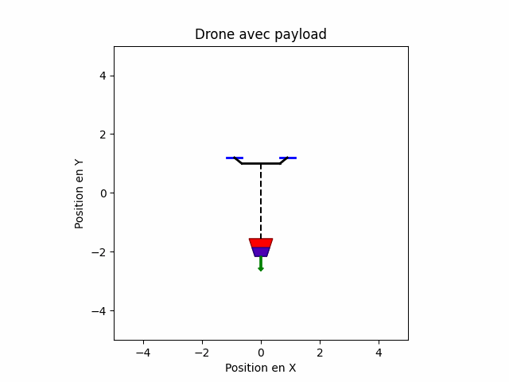
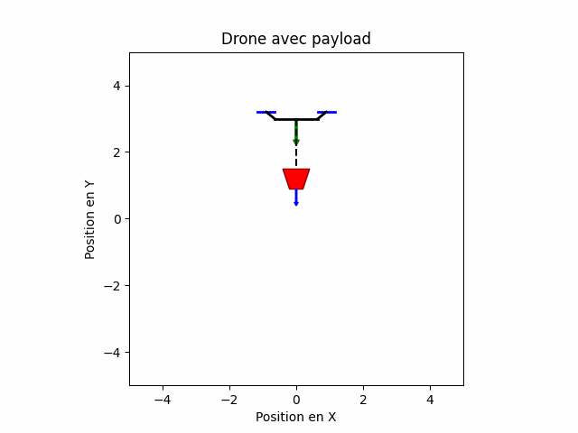
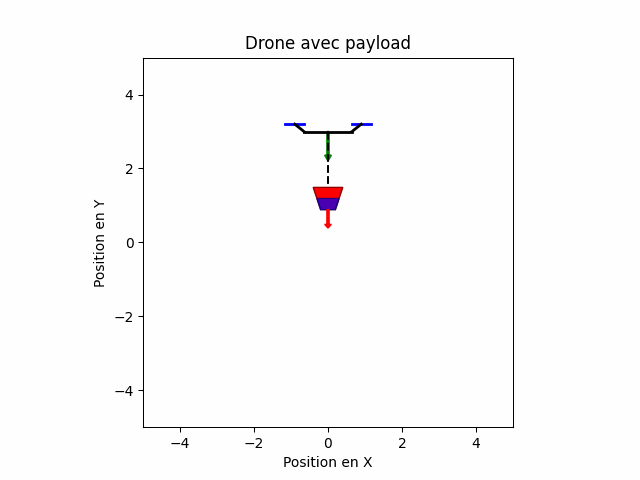

# Visualisation du drone avec payload d'eau

Première animation avec variation d'eau:

Deuxième animation avec variation d'altitude du drone:

Troisième animation avec variation d'altitude du drone et variation d'eau:

